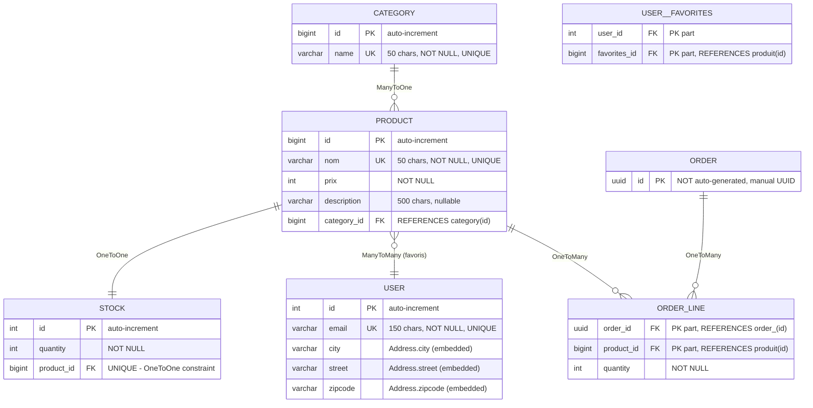

# Demo JPA/Hibernate - Guide complet pour apprenants

Bienvenue ! Ce projet est une **demo pedagogique** qui illustre les concepts fondamentaux de **JPA (Java Persistence API)** avec **Hibernate** et **PostgreSQL**.

## 📋 Table des matieres

1. [Qu'est-ce que JPA ?](#quest-ce-que-jpa)
2. [Architecture du projet](#architecture-du-projet)
3. [Configuration (persistence.xml)](#configuration-persistencexml)
4. [Le point d'entree (Main.java)](#le-point-dentree-mainjava)
5. [Les entites du modele metier](#les-entites-du-modele-metier)
6. [Concepts JPA detailles](#concepts-jpa-detailles)
7. [Diagramme des relations](#diagramme-des-relations)
8. [Lancer la demo](#lancer-la-demo)
9. [Questions frequentes](#questions-frequentes)

---

## Qu'est-ce que JPA ?

**JPA (Java Persistence API)** est une norme Java qui permet de faire le lien entre les **objets Java** (classes) et les **donnees SQL** (base de donnees relationnelle).

### Sans JPA (approche SQL classique)
```java
// Vous ecrivez manuellement du SQL brut
String sql = "INSERT INTO produit (nom, prix) VALUES ('Laptop', 999)";
statement.executeUpdate(sql);
```

### Avec JPA (approche orientee objet)
```java
// Vous manipulez des objets Java, JPA se charge du SQL
Product laptop = new Product("Laptop", 999);
entityManager.persist(laptop);  // JPA genere l'INSERT automatiquement
```

**Hibernate** est l'implementation la plus populaire de JPA.

---

## Architecture du projet

```
TF_Java2026_DemoJpa/
├── src/main/
│   ├── java/be/bstorm/
│   │   ├── Main.java                    <- Point d'entree
│   │   └── entities/                    <- Toutes les classes persistantes
│   │       ├── Address.java             <- Objet valeur embedded
│   │       ├── Category.java            <- Entite simple
│   │       ├── Product.java             <- Entite avec relation ManyToOne
│   │       ├── Stock.java               <- Entite avec relation OneToOne
│   │       ├── User.java                <- Entite avec ManyToMany
│   │       ├── Order.java               <- Entite avec UUID
│   │       └── OrderLine.java           <- Entite avec cle composite
│   └── resources/META-INF/
│       └── persistence.xml              <- Configuration JPA
├── pom.xml                              <- Dependances Maven
└── README.md                            <- Ce fichier
```

---

## Configuration (persistence.xml)

Le fichier `src/main/resources/META-INF/persistence.xml` est **CRUCIAL** : il dit a Hibernate comment se connecter a la base de donnees.

### Sections principales

```xml
<?xml version="1.0" encoding="UTF-8"?>
<persistence version="3.1"
             xmlns="https://jakarta.ee/xml/ns/persistence">
    
    <!-- Chaque <persistence-unit> est une "unite de persistance" (une config BD) -->
    <persistence-unit name="DemoJPA" transaction-type="RESOURCE_LOCAL">
        
        <!-- Le provider: qui va faire le travail de mapping objet-SQL -->
        <provider>org.hibernate.jpa.HibernatePersistenceProvider</provider>

        <properties>
            <!-- Connexion a PostgreSQL -->
            <property name="jakarta.persistence.jdbc.url" 
                      value="jdbc:postgresql://localhost:5432/demojpa"/>
            <property name="jakarta.persistence.jdbc.user" value="postgres"/>
            <property name="jakarta.persistence.jdbc.password" value="postgres"/>
            <property name="jakarta.persistence.jdbc.driver" 
                      value="org.postgresql.Driver"/>
            
            <!-- Hibernate: afficher les commandes SQL en console -->
            <property name="hibernate.show_sql" value="true"/>
            
            <!-- AUTO-CREATION DU SCHEMA !
                 Possible values:
                 - create     : drop + recreate le schema a chaque demarrage
                 - update     : adapte le schema existant
                 - validate   : verifie que le schema existe (erreur sinon)
                 - none       : aucune auto-generation
            -->
            <property name="hibernate.hbm2ddl.auto" value="create"/>
            
            <!-- Scan automatique de toutes les classes @Entity du classpath -->
            <property name="hibernate.archive.autodetection" value="class"/>
        </properties>
    </persistence-unit>
</persistence>
```

---

## Le point d'entree (Main.java)

```java
public class Main {
    public static void main(String[] args) {
        
        // 1. Creer la fabrique d'EntityManager
        //    C'est Hibernate qui lit persistence.xml et configure tout
        EntityManagerFactory emf = 
            Persistence.createEntityManagerFactory("DemoJPA");
        
        // 2. Ouvrir une session (EntityManager)
        //    C'est l'objet qui gere les operations de persistance
        EntityManager em = emf.createEntityManager();
        
        // 3. Afficher toutes les entites trouvees
        System.out.println(em.getMetamodel().getEntities());
        
        // 4. Creer une categorie (objet Java simple)
        Category category = new Category("Super ORM");
        
        // 5. Demarrer une transaction
        em.getTransaction().begin();
        
        // 6. Persister l'objet (le sauvegarder en base)
        em.persist(category);
        
        // 7. Valider la transaction (COMMIT)
        em.getTransaction().commit();
        
        // 8. Cleanup
        em.close();
        emf.close();
    }
}
```

### Ce qui se passe en coulisse

1. **Hibernate genere le SQL** : `INSERT INTO category (name) VALUES ('Super ORM')`
2. **La table est creee** si n'existe pas (grace a `hbm2ddl.auto=create`)
3. **La donnee est persistee** en base PostgreSQL
4. Vous voyez les commandes SQL en console grace a `show_sql=true`

---

## Les entites du modele metier

### 1️⃣ Address - Objet valeur EMBEDDED

```java
@Embeddable  // Pas de table separee, colones integrees dans la table proprietaire
public class Address {
    private String city;
    private String street;
    private String zipcode;
}
```

**Utilisation dans User:**
```java
@Embedded  // Les champs d'Address vont dans la table user_
private Address address;
```

**Resultat en base:**
```sql
CREATE TABLE user_ (
    id INTEGER PRIMARY KEY,
    email VARCHAR(150) NOT NULL UNIQUE,
    -- Les colonnes d'Address sont INLINE :
    city VARCHAR,
    street VARCHAR,
    zipcode VARCHAR
);
```

**Avantage:** Les donnees liees logiquement restent groupees sans table supplementaire.

---

### 2️⃣ Category - Entite simple

```java
@Entity
public class Category {
    @Id
    @GeneratedValue(strategy = GenerationType.IDENTITY)  // Auto-increment
    private Long id;
    
    @Column(length = 50, nullable = false, unique = true)
    private String name;
}
```

**Resultat en base:**
```sql
CREATE TABLE category (
    id BIGSERIAL PRIMARY KEY,
    name VARCHAR(50) NOT NULL UNIQUE
);
```

---

### 3️⃣ Product - Entite avec ManyToOne

```java
@Entity
@Table(name = "produit")
public class Product {
    @Id
    @GeneratedValue(strategy = GenerationType.IDENTITY)
    private Long id;
    
    @Column(length = 50, name = "nom", nullable = false, unique = true)
    private String name;
    
    @Column(name = "prix", nullable = false)
    private int price;
    
    @Column(length = 500, nullable = true)
    private String description;
    
    @ManyToOne  // Plusieurs produits -> une categorie
    private Category category;
}
```

**Relation**: `Product.category` → `Category.id`
- Plusieurs produits peuvent appartenir a la meme categorie
- JPA ajoute une **colonne FK** (foreign key)

**Resultat en base:**
```sql
CREATE TABLE produit (
    id BIGSERIAL PRIMARY KEY,
    nom VARCHAR(50) NOT NULL UNIQUE,
    prix INTEGER NOT NULL,
    description VARCHAR(500),
    category_id BIGINT REFERENCES category(id)  -- FK automatique !
);
```

---

### 4️⃣ Stock - Entite avec OneToOne

```java
@Entity
public class Stock {
    @Id
    @GeneratedValue(strategy = GenerationType.IDENTITY)
    private int id;
    
    @Column(nullable = false)
    private int quantity;
    
    @OneToOne  // Un stock <-> Un produit
    private Product product;
}
```

**Difference avec ManyToOne:**
- `ManyToOne` : plusieurs sources → une cible
- `OneToOne` : une source ↔ une cible

**Resultat en base:**
```sql
CREATE TABLE stock (
    id SERIAL PRIMARY KEY,
    quantity INTEGER NOT NULL,
    product_id BIGINT UNIQUE REFERENCES produit(id)  -- UNIQUE = 1-1
);
```

---

### 5️⃣ User - Entite avec ManyToMany

```java
@Entity
@Table(name = "user_")
public class User {
    @Id
    @GeneratedValue(strategy = GenerationType.IDENTITY)
    private int id;
    
    @Column(length = 150, nullable = false, unique = true)
    private String email;
    
    @Embedded
    private Address address;
    
    @ManyToMany  // Un user <-> Plusieurs produits favoris
    private List<Product> favorites = new ArrayList<>();
}
```

**Relation**: Plusieurs users ↔ Plusieurs products
- JPA cree automatiquement une **table de jointure**

**Resultat en base:**
```sql
CREATE TABLE user_ (
    id SERIAL PRIMARY KEY,
    email VARCHAR(150) NOT NULL UNIQUE,
    city VARCHAR, street VARCHAR, zipcode VARCHAR
);

CREATE TABLE user__favorites (
    user_id INTEGER REFERENCES user_(id),
    favorites_id BIGINT REFERENCES produit(id),
    PRIMARY KEY (user_id, favorites_id)
);
```

---

### 6️⃣ Order - Entite avec UUID

```java
@Entity
@Table(name = "order_")
public class Order {
    @Id  // Pas d'auto-increment, UUID genere manuellement
    private UUID id;
    
    public Order() {
        this.id = UUID.randomUUID();  // UUID unique automatique
    }
}
```

**Avantage du UUID:** Identifiant unique sans coordination avec la base, utile pour distribues.

---

### 7️⃣ OrderLine - Entite avec CLE COMPOSITE

```java
@Entity
public class OrderLine {
    @EmbeddedId  // La cle est composite (order + product)
    private OrderLineId id;
    
    @Column(nullable = false)
    private int quantity;
    
    @ManyToOne
    @MapsId("orderId")  // Lie la FK order au champ orderId de la cle
    private Order order;
    
    @ManyToOne
    @MapsId("productId")  // Lie la FK product au champ productId
    private Product product;
    
    // Cle composite embedded
    @Embeddable
    public static class OrderLineId {
        private UUID orderId;
        private Long productId;
    }
}
```

**Modele courant:** Une commande avec plusieurs produits
- 1 Order peut avoir N OrderLine
- 1 Product peut etre dans N OrderLine
- OrderLine est identifiee UNIQUEMENT par (orderId, productId)

**Resultat en base:**
```sql
CREATE TABLE order_ (
    id UUID PRIMARY KEY
);

CREATE TABLE order_line (
    order_id UUID NOT NULL,
    product_id BIGINT NOT NULL,
    quantity INTEGER NOT NULL,
    PRIMARY KEY (order_id, product_id),
    FOREIGN KEY (order_id) REFERENCES order_(id),
    FOREIGN KEY (product_id) REFERENCES produit(id)
);
```

---

## Concepts JPA detailles

### @Entity
Marque une classe comme **table persistante**. Hibernate genere une table du meme nom (ou via `@Table(name=...)`).

### @Id + @GeneratedValue
- `@Id` : indique le champ de **cle primaire**
- `@GeneratedValue(strategy=GenerationType.IDENTITY)` : auto-increment SQL

### @Column
Personnalise la colonne SQL:
- `length` : longueur max
- `nullable` : NOT NULL constraint
- `unique` : UNIQUE constraint
- `name` : nom de colonne different du champ Java

### @Embeddable + @Embedded
- `@Embeddable` : classe qui sera **integree** dans d'autres tables
- `@Embedded` : champ qui utilise une classe embeddable

**Avantage:** Grouper des donnees liees sans table supplementaire.

### @ManyToOne
**Plusieurs de mon entite pointent vers une seule entite cible.**
```
Product.category (N) ---> Category (1)
```
JPA ajoute une **colonne FK**.

### @OneToOne
**Relation 1-1 bidirectionnelle ou unidirectionnelle.**
```
Stock (1) ----> Product (1)
```

### @ManyToMany
**N-N relation, creee une table de jointure automatiquement.**
```
User (N) <---> Product (N)
           via user__favorites
```

### @EmbeddedId + @MapsId
Pour les cles composites:
- `@EmbeddedId` : la cle est une classe embeddable
- `@MapsId("fieldName")` : synchronise une FK avec un champ de la cle

---

## Diagramme des relations

### Vue textuelle

```
Category (1) ──────► Product (N) ──────► Stock (1)
                          │
                          │ (ManyToMany)
                          ▼
                        User ──── Favoris

Order (1) ──────► OrderLine (N) ◄────── Product (N)
```

**Resume des relations:**
- `Category` → `Product` : **ManyToOne** (plusieurs produits par categorie)
- `Product` ↔ `Stock` : **OneToOne** (un stock par produit)
- `User` ↔ `Product` : **ManyToMany** (favoris, table de jointure)
- `Order` → `OrderLine` : **OneToMany** (plusieurs lignes par commande)
- `Product` → `OrderLine` : **OneToMany** (plusieurs lignes pour ce produit)

---

### Diagramme detaille (Mermaid)



**Legende:**
- **PK** = Primary Key (cle primaire)
- **FK** = Foreign Key (cle etrangere)
- **UK** = Unique Key (contrainte unique)
- **||** = exactement 1
- **o{** = 0 ou plusieurs
- **||--o{** = One-To-Many (1 vers N)
- **||--||** = One-To-One (1 vers 1)
- **}o--||** = Many-To-Many (N vers N)

### Explication du diagramme

- **Cardinalites** : 
  - `||` = 1 (exactement 1)
  - `o{` = 0 ou plusieurs
  - `||--o{` = 1 vers N (ex: Category vers Product)
  - `||--||` = 1 vers 1 (ex: Product vers Stock)
  - `}o--||` = N vers N (ex: User vers Product via favoris)

- **PK** = Primary Key (cle primaire)
- **FK** = Foreign Key (cle etrangere)
- **UK** = Unique Key (contrainte unique)
- **UNIQUE** = Cette colonne FK ne peut contenir qu'une reference unique (OneToOne)

---

## Lancer la demo

### Prerequisites

1. **PostgreSQL** doit etre en cours d'execution
   ```powershell
   # Sur votre machine, verifiez que PostgreSQL ecoute sur localhost:5432
   ```

2. **La base "demojpa" doit exister** (ou etre creee)
   ```sql
   CREATE DATABASE demojpa;
   ```

3. **Maven** et **Java 25** (ou compatible) installes

### Commande

```powershell
Set-Location "C:\Users\byase\Documents\Programming\BirthList\TF_Java2026_DemoJpa"
mvn clean compile exec:java "-Dexec.mainClass=be.bstorm.Main"
```

### Resultat attendu

```
[Entity-1 Category, Entity-2 Product, Entity-3 Stock, Entity-4 User, 
 Entity-5 Order, Entity-6 OrderLine, Entity-7 Address]

(log SQL Hibernate montrant les CREATE TABLE ...)

Hibernate: CREATE TABLE category (...)
Hibernate: CREATE TABLE produit (...)
Hibernate: CREATE TABLE stock (...)
... etc
```

---

## Questions frequentes

### Q1: Pourquoi `persistence.xml` ?
**R:** JPA a besoin de savoir comment se connecter a la base (URL, user, driver). C'est la norme Jakarta pour centraliser cette config.

### Q2: Pourquoi `@Entity` sur chaque classe ?
**R:** JPA scanne le classpath et cherche les classes avec `@Entity`. Sans cette annotation, la classe est un POJO (Plain Old Java Object) normal, PAS une table.

### Q3: La difference entre `@Column` et `@Basic` ?
**R:** 
- `@Column` : personnalise la colonne SQL (name, length, nullable, unique, etc.)
- `@Basic` : juste dit "c'est un champ basique" (optionnel, par defaut)

### Q4: Pourquoi `@Table(name = "order_")` ?
**R:** `order` est un mot-cle SQL reserve dans PostgreSQL. On renomme la table pour eviter les conflits.

### Q5: Comment persister une entite avec relations ?
**R:** JPA gere les relations automatiquement.
```java
Category cat = new Category("Electronique");
Product product = new Product("Laptop", 999);
product.setCategory(cat);

em.persist(cat);       // Persiste la categorie
em.persist(product);   // Persiste le produit + la FK vers category
```

### Q6: Que signifie `@MapsId("orderId")` ?
**R:** C'est un raccourci pour "utilise l'id de la relation Order dans ma cle composite". Au lieu d'avoir deux colonnes FK et une cle separee, on les fusionne : la cle composite EST les deux FKs.

### Q7: Comment ajouter un nouvel attribut a une entite ?
**R:** Simplement ajouter un champ et un getter/setter. Hibernate adapte le schema (avec `hbm2ddl.auto=update`).

### Q8: C'est normal d'avoir beaucoup de `@Column` ?
**R:** Oui ! C'est la norme JPA pour documenter et controler le mapping objet-SQL. Les apprenants doivent comprendre chaque contrainte.

---

## Prochaines etapes

1. **Modifiez les entites** et relancez (ajoutez des champs, des relations)
2. **Testez les operations CRUD** : Create, Read, Update, Delete
3. **Explorez les relations bidirectionnelles**
4. **Essayez les requetes JPQL** : `SELECT p FROM Product p WHERE p.price > 500`

Bon apprentissage ! 🚀


